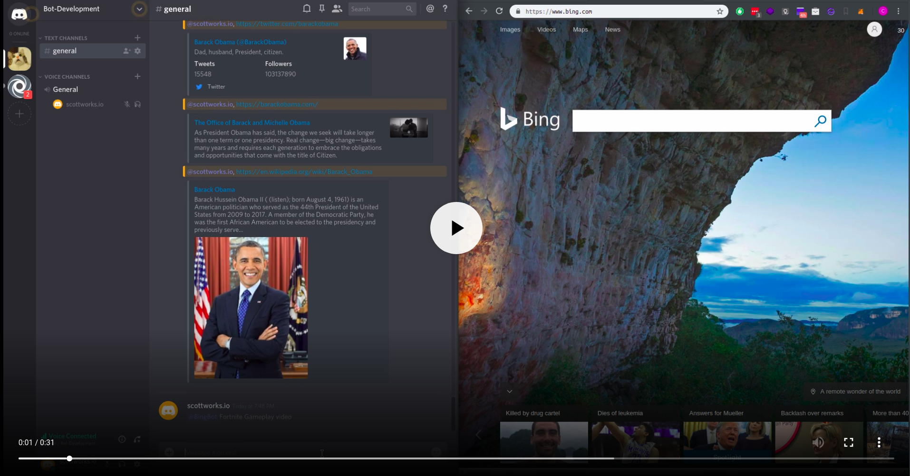

## Motivation

The goal of this project was to accomplish several things:

- [x] Learn how to spin a server using pure NodeJS
- [x] Enhance my understanding of concepts related to server technology, i.e. Event Emitters, Event Listeners, and API's.
- [ ] Win some swag in the [Discord Bot Competition](https://repl.it/talk/challenge/Discord-Bot-Competition/8403?ref=newsletter) (results pending)

## What is the BingBot?

The BingBot is a simple chatbot that responds to search engine queries with the top 5 webpages.

## How do I use it?

In the following [link](https://discordapp.com/api/oauth2/authorize?client_id=513027290771226640&scope=bot&permissions=1) you will be asked to to add BingBot to a server you manage.


Once you've added BingBot to your server you can ask it to fetch the top five search results from [Bing.com](https://www.bing.com). All you need to do is call BingBot and enter your search.

Example: `@BingBot Black Panther Movie Trailer`

[](https://res.cloudinary.com/dcgnyswpg/video/upload/v1542427318/BingBot-Demo_jqiauh.mp4)

## How do I use this repo?

Assuming you have NPM installed already

1. Fork then clone it
2. `npm install`
3. Create a .env file on the root directory, note you will need to use the same variables or change them in the /server/index.js file.

```
AZURE_SUBSCRIPTION_KEY= <ADD YOUR KEYS HERE>
DISCORD_BOT_SECRET= <ADD YOUR KEYS HERE>
PORT=3000
```

4. If you do not have one already, create an account with [Microsoft Azure](https://docs.microsoft.com/en-us/azure/cognitive-services/bing-web-search/quickstarts/nodejs). Obtain API Keys for their Bing Search service then add keys to the .env file.
5. Create a new App and Bot on [Discord](https://discordapp.com/developers/applications/), under the bot tab copy the 'token' into your .env file.
6. Start your server and have fun!

Note: It is possible to use [repl.it](https://www.repl.it) to continuously host your BingBot, check out [this awesome tutorial](https://repl.it/talk/learn/Tutorial-Building-a-Discord-bot-with-Nodejs/6659) on how to do so.
